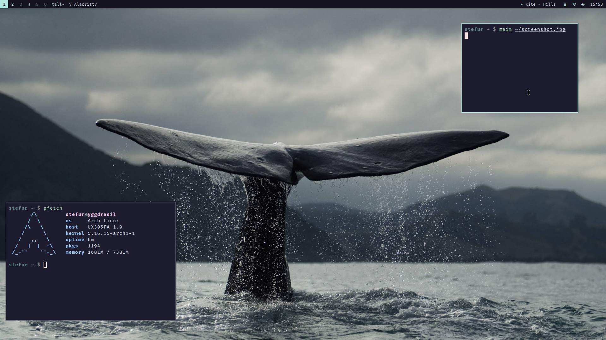

## Qtile configuration
This is my configuration for [Qtile](https://github.com/qtile/qtile). It's geared towards Qtile `HEAD` and a constant WIP. :)



## Acknowledgements
Many thanks to the developers, past and present, of the Qtile window manager.
A special shout-out to [elParaguayo](https://github.com/elParaguayo) for making [qtile-extras](https://github.com/elParaguayo/qtile-extras) from which I've borrowed ideas.
And not to mention [m-col](https://github.com/m-col/) whose config I've also taken both bits and inspiration from.

## Features
Some functionality here may be of interest to others, so I've tried to summarize it here. I welcome any feedback or suggestions.

- [Spawn or focus application](#spawn-or-focus-application)
- [Focus browser if urgent](#focus-browser-if-urgent)
- [Spotify group assign workaround](#spotify-group-assign-workaround)
- [Simple layout toggle](#simple-layout-toggle)
- [Fallback to default layout](#fallback-to-default-layout)
- [Volume widget only updates when necessary](#volume-widget-only-updates-when-necessary)
- [Battery widget using battery level icons and DBus](#battery-widget-with-battery-level-icons-and-dbus)
- [Wifi widget using DBus signals](#wifi-widget-using-dbus-signals)
- [Spotify widget using DBus signals](#spotify-widget-using-dbus-signals)
- [Discord client close and minimize fix](#discord-client-close-and-minimize-fix)

### Spawn or focus application
Also sometimes known as "*run or raise*" in other tiling window managers, such as Xmonad. The basic idea is to check if an application is already running before it's spawned. If it's running, focus the window.

The by far easiest solution is to use an application like `wmctrl` in a script, but I decided to implement something that wouldn't depend on any 3rd party application.

The method to spawn or focus is the following:

```python
from libqtile import qtile

@lazy.function
def spawn_or_focus(qtile: Qtile, app: str) -> None:
    """Check if the app being launched is already running, if so focus it"""
    window = None
    for win in qtile.windows_map.values():
        if isinstance(win, Window):
            wm_class = win.get_wm_class()
            assert wm_class is not None
            if any(item.lower() in app for item in wm_class):
                window = win
                group = win.group
                assert group is not None
                group.cmd_toscreen(toggle=False)
                break

    if window is None:
        qtile.cmd_spawn(app)
        return
```

What happens here is that we try to find any already open window of the application by looking up all the open windows. Specifically we try to match the app with `wm_class` for each window.

In the event of a window match we find the group on which its on and move there. When that's done we move the group to the screen.

Should no match be found, and window remains `None`, it will instead spawn the app.

In the keybinds the above method can be used as:
```python
EzKey('M-c', spawn_or_focus('signal-desktop'))
```

Another behavior that might be desirable is to bring the window to main pane if the window is in the stack, similar to Xmonads `runOrRaiseMaster`. If so, add the following to the above method:

```diff
    if window is None:
        qtile.cmd_spawn(app)
        return
+
+    if window == qtile.current_window:
+        try:
+            qtile.current_layout.cmd_swap_main()
+        except AttributeError:
+            return
+    else:
+        qtile.current_group.focus(window)
```
This does however assume that the MonadTall layout is being used. But with little modification it can easily be adapted and use for other layouts as well.

### Focus browser if urgent  
I don't like when applications take focus whenever they want, and for this reason the window activation is set to `urgent`. 
However I do want to focus the browser whenever a URL is clicked, that's the only exception to the rule in my use case.

One way to do this would be to use the `@hook.subscribe.client_urgent_hint_changed`. But after testing that I realized that, for whatever reason, Firefox specifically wouldn't set the urgent hint unless an URL was clicked *twice*. This was annoying and therefore not an option.
Other applications I tested did not have this issue.

My alternative solution became this:
```python
@hook.subscribe.client_name_updated
def follow_url(client: Window) -> None:
    """If Firefox is flagged as urgent, focus it"""
    wm_class: list | None = client.get_wm_class()
    assert wm_class is not None
    for item in wm_class:
        if BROWSER in item and client.urgent is True:
            assert qtile and client.group is not None
            qtile.current_screen.set_group(client.group)
            client.group.focus(client)
```
In the above case `BROWSER = 'firefox'`.
The hook that activates when a client name is updated checks if it is indeed the browser that is updating its name *and* checking if the urgent flag is set to `True`. The urgent flag is set by Qtile and not the same as the window hint.

This means that whenever a URL is clicked Firefox updates its name as a result, and the urgent flag is set. Then Qtile pulls in that group to the screen and focuses the browser.

### Spotify group assign workaround
Spotify sets its `wm_class` late on startup, meaning it's not catched by any rules when spawned. This is not unique to Qtile. I've hade the same issue (and hacky solution) in other window managers such as Xmonad and DWM.

With the use of a hook to catch Spotify once it's name is set we can also check the wm_class again. If we find it we can then push it to its assigned group (workspace), in my case "4".

As you can see below we make sure that the name of the window is "Spotify" as well as checking that the `wm_class` is indeed empty. This is to prevent accidentally pushing other windows to another group.

```python
@hook.subscribe.client_name_updated
def push_spotify(client: Window) -> None:
    """Push Spotify to correct group since it's wm_class setting is slow"""
    if client.cmd_info().get("name") == "Spotify" and not client.get_wm_class():
        client.cmd_togroup("4")
```

### Simple layout toggle
Toggle layout by name. Always go back to the default layout.

```python
@lazy.function
def toggle_layout(qtile: Qtile, layout_name: str) -> None:
    """Takes a layout name and tries to set it, or if it's already active back to monadtall"""
    screen_rect = qtile.current_group.screen.get_rect()
    qtile.current_group.layout.hide()
    if qtile.current_group.layout.name == layout_name:
        qtile.current_group.cmd_setlayout(layout_names["monadtall"])
    else:
        qtile.current_group.cmd_setlayout(layout_name)
    qtile.current_group.layout.show(screen_rect)
```

And in the keybinds something like:  
`EzKey('M-m', toggle_layout(layout_names['max']))`

You could just as well use `qtile.cmd_to_layout_index` instead of `cmd_setlayout`, it essentially does exactly the same thing. It's just personal preference.

### Fallback to default layout
I don't use many different layouts, it's usually just the standard `monadtall`. But when there are many windows on a group I tend to use either `max`or `treetab`. I don't want to manually have to reset the layout after closing all the windows, so instead I use this hook to go back to `monadtall` if there is less than 2 windows open left on the group.

```python
@hook.subscribe.client_killed
def fallback_default_layout(client: Window) -> None:
    """Reset a group to default layout when theres is only one window left"""
    try:
        assert client.group is not None
        win_count = len(client.group.windows)
    except AttributeError:
        win_count = 0

    if win_count > 2:
        return

    try:
        assert client.group is not None
        screen = client.group.screen
    except AttributeError:
        return

    if screen is None:
        assert qtile is not None
        screen = qtile.current_group.screen

    screen_rect = screen.get_rect()
    client.group.layout.hide()
    client.group.cmd_setlayout(layout_names["monadtall"])
    client.group.layout.show(screen_rect)
```

### Volume widget only updates when necessary
My custom volume widget only updates when volume is increased/decreased/muted.

See [volume.py](https://github.com/stefur/qtile-config/blob/main/volume.py).

### Battery widget with battery level icons and DBus
Using symbols from Nerd Fonts to show 11 different battery level icons, because why not.

The widget uses DBus to listen to signals from upower to update the battery level and charging status.

You can find all of it in [battery.py](https://github.com/stefur/qtile-config/blob/main/battery.py).

### Wifi widget using DBus signals
Similar to the battery widget I use DBus to listen to signals from connman, my connection manager of choice.

For more details, see [wifi.py](https://github.com/stefur/qtile-config/blob/main/wifi.py).

### Spotify widget using DBus signals
A custom Spotify widget that uses DBus to pick up signals from Spotify to display current playback status and information in the bar in the format of `artist - song`. It uses some truncation that can be modified, as well as colors and playback icons. Also allows for playback control via mouse callbacks.

Find it all in [spotify.py](https://github.com/stefur/qtile-config/blob/main/spotify.py).

### Discord client close and minimize fix
Discord is not minimizing properly on window kill/close. This is an issue specific for my laptop and I have no idea why. The issues results in a weird window artifact remaining on screen every time. With a hook on window kill Discord is toggled to actually minimize to tray as it should.

```python
@hook.subscribe.client_killed
def minimize_discord(client: Window) -> None:
    """Discord workaround to fix lingering residual window after its been closed to tray"""
    wm_class: list | None = client.get_wm_class()
    assert wm_class is not None
    for item in wm_class:
        if "discord" in item:
            client.cmd_toggle_floating()
            client.cmd_toggle_minimize()
```