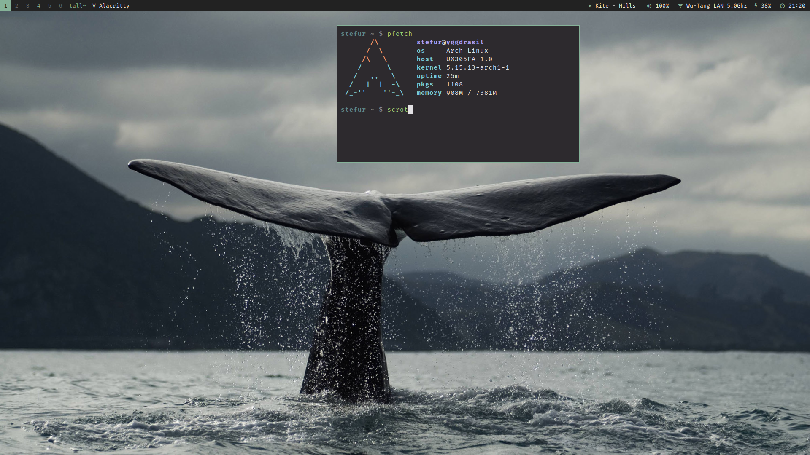

## Qtile configuration
This is my configuration for [Qtile](https://github.com/qtile/qtile). It's geared towards Qtile `HEAD` and a constant WIP. :)



## Table of contents
Some functionality here may be of interest to others, so I've tried to summarize some of it here.
Feedback and suggestions are very welcome.

- [Spawn or focus application](#spawn-or-focus-application)
- [Focus browser if urgent](#focus-browser-if-urgent)
- [Spotify group assign workaround](#spotify-group-assign-workaround)
- [Simple layout toggle](#simple-layout-toggle)
- [Fallback to default layout](#fallback-to-default-layout)
- [Volume widget only updates when necessary](#volume-widget-only-updates-when-necessary)
- [Battery widget with battery level icons](#battery-widget-with-battery-level-icons)
- [Spotify widget](#spotify-widget)
- [Discord client close and minimize fix](#discord-client-close-and-minimize-fix)

## Spawn or focus application 
Also sometimes known as "*run or raise*" in other tiling window managers, such as Xmonad. The basic idea is to check if an application is already running before it's spawned. If it's running, focus the window.

The by far easiest solution is to use an application like `wmctrl` in a script, but I decided to implement something that wouldn't depend on any 3rd party application.

The command to run an app does not always correspond to the `wm_class`. For example running `steam-native` gives the class string `Steam`.

To mitigate this I set up the following dict:

```python
appcmd_to_wm_class = {
    'signal-desktop': 'signal',
    'steam-native': 'Steam'
}
```

The method to spawn or focus is the following:

```python
from libqtile import qtile

@lazy.function
def spawn_or_focus(qtile, app):
    try:
        app_wm_class = appcmd_to_wm_class.get(app) if app in appcmd_to_wm_class else app        
        open_windows = set(qtile.windows_map[wid].window for wid in qtile.windows_map)
        find_window = [window for window in open_windows if app_wm_class in window.get_wm_class()][0]
        group_number = str(find_window.get_wm_desktop() + 1)
        group = qtile.groups_map[group_number]
        select_window = [window for window in group.windows if find_window.wid == window.wid][0]
        qtile.current_screen.set_group(group)
        qtile.current_group.focus(select_window)
    except IndexError:
        qtile.cmd_spawn(app)
```

What happens here is that we try to find any already open window of the application by looking up all the open windows and their window ID (`wid`). Specifically we try to match the app with `wm_class` for each window.

In the event of a window match we can grab the desktop number (group/workspace number), which is an int. NB the `+ 1` as well. This is because the workspace index starts at 0. So workspace 1 would otherwise become worksapce 0.

We then proceed to select the window in the given group by matching the `wid`s. When that's done we move the screen to the group, and once there focus our selected window which will bring it to the front in case the layout for example is set to `max` or `treetab`.

Now, should the above fail (which it will, if no window with a matching `wm_class` is found) it will instead spawn the app.

In the keybinds the above method can be used as:
```python
EzKey('M-c', spawn_or_focus('signal-desktop'))
```

## Focus browser if urgent  
I don't like when applications take focus whenever the want, and for this reason the window activation is set to `urgent`. 
However I did want to focus the browser whenever a URL is clicked, that's the only exception to the rule in my use case.

One way to do this would be to use the `@hook.subscribe.client_urgent_hint_changed`. But after testing that I realized that, for whatever reason, Firefox specifically wouldn't set the urgent hint unless an URL was clicked *twice*. This was annoying and therefore not an option.
Other applications I tested did not have this issue.

My alternative solution became this:
```python
@hook.subscribe.client_name_updated
def follow_url(client):
    if BROWSER in client.window.get_wm_class() and client.urgent is True:
            qtile.current_screen.set_group(client.group)
            client.group.focus(client)
```
In the above case `BROWSER = 'firefox'`.
The hook that activates when a client name is updated checks if it is indeed the browser that is updating its name *and* checking if the urgent flag is to `True`. The urgent flag is set by Qtile and not the same as the window hint.

This means that whenever a URL is clicked, Firefox updates its name as a result of this, and the urgent flag is set. Then Qtile pulls in that group to the screen and focuses the browser.

## Spotify group assign workaround
Spotify sets its `wm_class` late on startup, meaning it's not catched by any rules when spawned. This is not unique to Qtile. I've hade the same issue (and hacky solution) in other window managers such as Xmonad and DWM.

With the use of a hook to catch Spotify once it's name is set we can also check the wm_class again. If we find it we can then push it to its assigned group (workspace), in my case "4".

```python
@hook.subscribe.client_name_updated
def push_spotify(client):
    if "spotify" in client.window.get_wm_class():
            client.togroup('4')
```

## Simple layout toggle
Toggle layout by name. Always go back to the default layout.

```python
@lazy.function
def toggle_layout(qtile, layout_name):
    screen_rect = qtile.current_group.screen.get_rect()
    qtile.current_group.layout.hide()
    if qtile.current_group.layout.name == layout_name:
        qtile.current_group.cmd_setlayout(layout_names['monadtall'])        
    else:
        qtile.current_group.cmd_setlayout(layout_name)
    qtile.current_group.layout.show(screen_rect)
```

And in the keybinds something like:  
`EzKey('M-m', toggle_layout(layout_names['max']))`

You could just as well use `qtile.cmd_to_layout_index` instead of `cmd_setlayout`, it essentially does exactly the same thing. It's just personal preference.

## Fallback to default layout
I don't use many different layouts, it's usually just the standard `monadtall`. But when there are many windows on a group I tend to use either `max`or `treetab`. I don't want to manually have to reset the layout, so instead I use this hook to go back to `monadtall` if there is less than 2 windows open left on the group.

```python
@hook.subscribe.client_killed
def fallback_default_layout(client):
    try:
        win_count = len(client.group.windows)
    except AttributeError:
        win_count = 0

    if win_count > 2:
        return

    screen = client.group.screen

    if screen is None:
        screen = qtile.current_group.screen
    
    screen_rect = screen.get_rect()
    client.group.layout.hide()
    client.group.cmd_setlayout(layout_names['monadtall'])        
    client.group.layout.show(screen_rect)
```

## Volume widget only updates when necessary
My custom volume widget only updates when volume is increased/decreased/muted.

See [volume.py](https://github.com/stefur/qtile-config/blob/main/volume.py).

## Battery widget with battery level icons
Using symbols from Nerd Fonts to show 11 different battery level icons, because why not.
You can find all of it in [battery.py](https://github.com/stefur/qtile-config/blob/main/battery.py).

## Spotify widget
A custom Spotify widget that uses DBus to pick up signals from Spotify to display current playback status and information in the bar in the format of `artist - song`. It uses some truncation that can be modified, as well as colors and playback icons. Also allows for playback control via mouse callbacks.

Find it all in [spotify.py](https://github.com/stefur/qtile-config/blob/main/spotify.py).

## Discord client close and minimize fix
Discord is not minimizing properly on window kill/close. This is an issue specific for my laptop and I have no idea why. The issues results in a weird window artifact remaining on screen every time. With a hook on window kill Discord is toggled to actually minimize to tray as it should.

```python
@hook.subscribe.client_killed
def minimize_discord(client):
    if "discord" in client.window.get_wm_class():
        client.toggle_minimize()
```